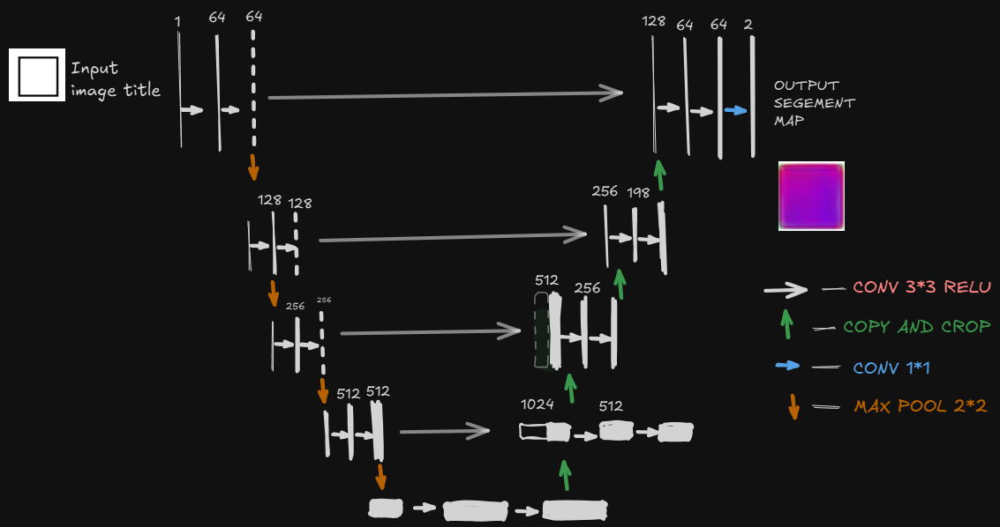
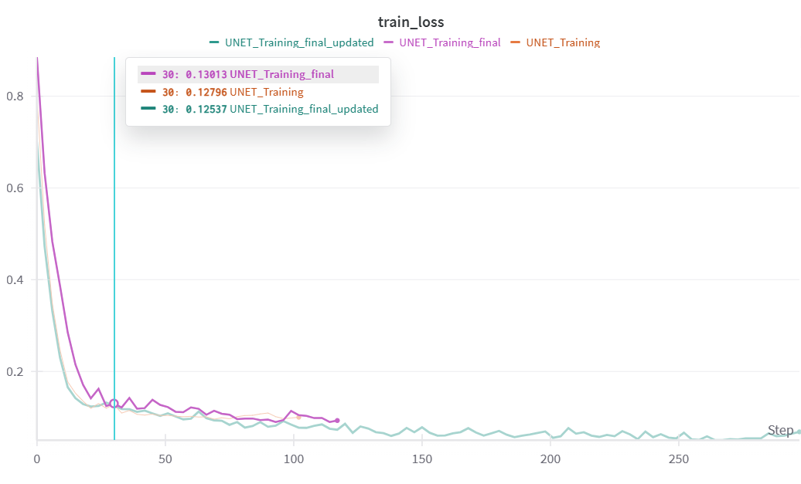

# UNet Polygon Colorizer Project Report

## Architecture: UNet Design & Conditioning

The model is based on a UNet architecture, a powerful choice for image-to-image translation. The primary design challenge was to effectively condition the model on non-spatial input (the color name).

-- UNet Structure: The model consists of a symmetric encoder-decoder path with a bottleneck layer. The encoder uses a series of DoubleConv and MaxPool2d layers to downsample the input image, extracting high-level features. The decoder uses Upsample and DoubleConv layers to reconstruct the output image. Crucially, skip connections from the encoder's feature maps are concatenated with the decoder's upsampled feature maps at each level, ensuring the final output retains fine-grained spatial details.
-- Conditional Injection: To condition the UNet on a specific color, a unique conditioning method was implemented. A color name (e.g., "blue") was converted into a one-hot vector and then into a 64-dimensional embedding using an nn.Linear layer. This color embedding was then tiled and concatenated with the feature maps at every upsampling stage of the decoder. This provided a strong, persistent signal, guiding the model's color generation throughout the reconstruction process.

## Training Dynamics

The training journey was marked by initial failures and subsequent debugging, which are well-documented in the accompanying wandb project.

- Failure Modes: Initial training runs were unstable and resulted in qualitatively poor outputs. The model consistently produced blurry, reddish polygons, regardless of the target color. This was attributed to a weak conditioning signal.

Fixes Attempted:

- Data Consistency: The initial AttributeError caused by inconsistent color maps between training and validation data was resolved by creating a single, universal color map from the training set.
- Architectural Fix: The model's architecture was refined by injecting the color embedding at every upsampling layer, rather than just the bottleneck. This provided a stronger conditioning signal to the decoder.
- Data Quality Fix: An initial failure to generate a specific color was traced back to a missing data point in the training set. This was a critical learning moment that highlighted the importance of a clean and complete dataset.
- Final Output Trends: After implementing the fixes, the training dynamics improved significantly. The model showed a consistent decrease in both training and validation loss. Qualitatively, the output images evolved from blurry, incorrectly colored shapes to sharp, perfectly colored polygons, demonstrating that the model was successfully learning both shape and color simultaneously.

## Key Learnings
-- Importance of Data: A critical learning was the impact of data quality on model performance. An initial failure to generate a specific color was traced back to a missing data point in the training set, highlighting that a model is only as good as its data.

-- Systematic Debugging: Debugging is an essential skill in machine learning. By using a systematic approach with wandb to monitor metrics and print statements to inspect internal tensor shapes, we were able to diagnose and fix critical issues.

-- Conditional Design: For conditional image generation, the conditioning signal must be strong and consistently propagated through the network. Injecting the color embedding at multiple levels proved to be a robust strategy.
